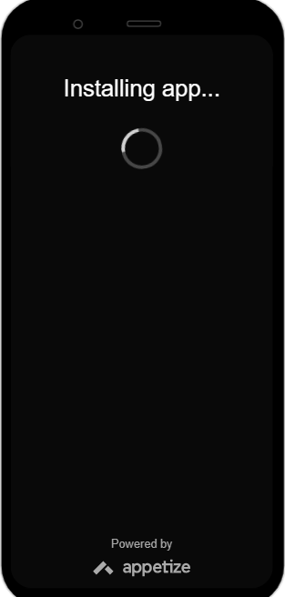

# Toodolist

 

  

    
  

## Features

- [x] Create Todo
- [x] Update Todo
- [x] Edit Todo
- [x] Priority Based Todo Coloring
- [x] View Todo

## Requirements

- iOS 13+
- Xcode 14

## Installation

- npm install -g react-native-cli
- cd react-native-quick-sample
- npm install
- react-native run-ios
