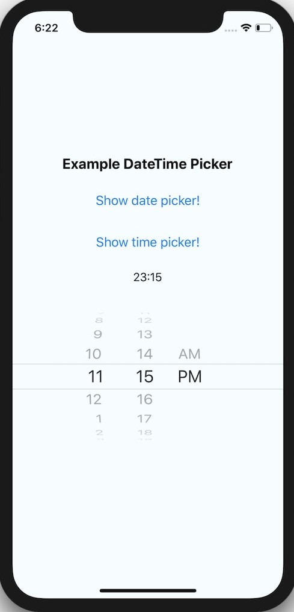
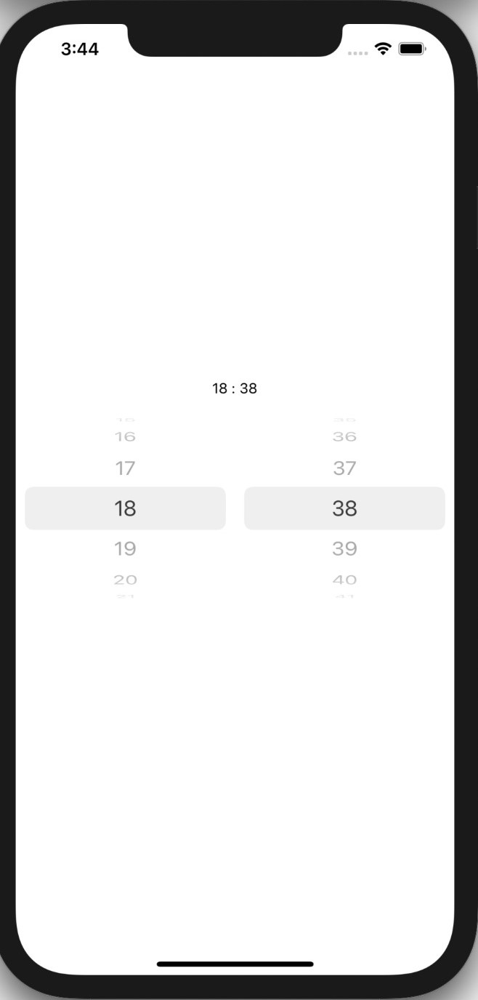
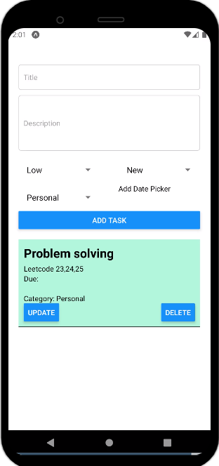
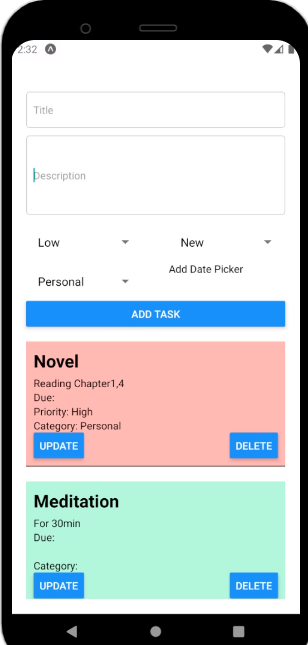

# Toodolist

 

  

    Building a Simple To-Do List Application.
  

  

## Features

- [x] Due Date
- [x] Priority Levels(Low,Medium,High)
- [x] Category
- [x] Title And Description
- [x] Task Status

## Requirements

- iOS 13+
- Xcode 14

## Installation

- npm install -g react-native-cli
- cd react-native-quick-sample
- npm install
- react-native run-ios
